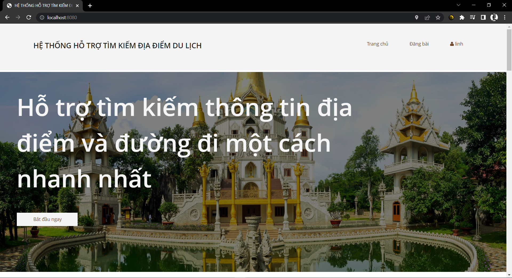

# Thông tin về Tác giả
Nguyễn Quốc Anh <br>
Bùi Lê Anh Duy<br>
Trần Thanh Bình <br>
Đỗ Nguyễn Duy Linh

# Mô tả
Thể hiện thông tin địa điểm trên bảng đồ MYTOUR là website được thiết kế nhằm mục đích phục vụ nhu cầu tìm kiếm các địa điểm du lịch của mọi người, thể hiện thông tin cũng như các đặc điểm của địa điểm du lịch đó. Ngoài ra web còn hỗ trợ công cụ tìm kiếm các danh mục cần thiết như mà hiện thị nhà hàng, quán cafe cần thiết

# Hướng dẫn sử dụng
## Bước 1: Clone source dự án
Thực thi câu lệnh sau:
```
git clone https://github.com/leokaa/HeThongDanDuongDi.git
```

## Bước 2: Khởi tạo, kết nối database và các cấu hình cần thiết
Hiệu chỉnh file application.properties
```
spring.mvc.view.suffix=.jsp
spring.mvc.view.prefix=/view/
spring.datasource.url=jdbc:mysql://${MYSQL_HOST:localhost}:3306/map
spring.datasource.username=root
spring.datasource.password=
spring.jpa.hibernate.naming.physical-strategy=org.hibernate.boot.model.naming.PhysicalNamingStrategyStandardImpl
spring.jpa.properties.hibernate.format_sql=true
spring.datasource.driver-class-name =com.mysql.cj.jdbc.Driver
spring.servlet.multipart.max-file-size=20MB
spring.servlet.multipart.max-request-size=20MB
spring.web.resources.static-locations=src\\main\\resources\\static\\hinhanh\\
```

## Bước 3: Chạy project và truy cập vào đỉa chỉ localhost:8080/ 
-Tài khoản Admin: admin / anhduymm098 <br>
-Tài khoản Nhân viên: linh / 1234578, ...

## Giao diện website
<p align="center">
  
</p>
<br>
<br>
<p align="center">
  
</p>


